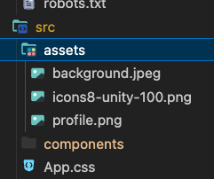

# 프로젝트 가져오기 및 배포 프로세스

## 프로젝트 가져오기

1. node, yarn 설치
```
터미널에 node -v, yarn -v 입력 시,  버전이 뜨면 설치 되어있는 상태.
```
2. Repository 생성하기 ex) portfolio
   - 반드시 <strong>public</mark>으로 만들어야 함. readme.md는 생성 x 

4. https://github.com/liMoHa/outsourcing-portfolio-dh 로 이동 후 리포 복사 및 터미널에 다음 명령어 입력
   
```bash
cd ~/Desktop/dev (로컬에서 개발할 때 프로젝트 위치로 이동)
```

```bash
git clone https://github.com/liMoHa/outsourcing-portfolio-dh.git (클론받기)
```

```bash
mv outsourcing-portfolio-dh {2번에서 생성한 리포 이름} (클론 받아온 폴더 이름을 앞으로 새로운 저장소가 될 리포 이름(2번에서 생성)으로 수정)
ex) mv outsourcing-portfolio-dh my-portfolio
```

```
cd my-portfolio (클론 받은 폴더 안으로 이동)
```

```
git remote rm origin (기존 원격 저장소 삭제)
```

```
git remote add origin https://github.com/{username}/{repositoryname}.git (자신의 원격 저장소 연결)
```

```
yarn install (의존성 패키지 설치)
```

```
git push origin {mainbranchname} (원격 저장소에 push)
```

```
yarn start (react 실행)
local:3000 열어서 동작 확인
```


여기까지 정상적으로 됐다면, 성공적으로 프로젝트를 클론 받은 것임.

## gh-pages 배포

1. homepage 수정
```
"homepage" 부분을 아래와 같이 수정.

"homepage": "https://{username}.github.io/{repository이름}”
ex) "homepage": "https://DahyeChung.github.io/my-portfolio"
```


2. deploy 체크
```
 “scripts”안에 "deploy": "gh-pages -d build" 가 적혀 있는지 확인

```


3. github > my-portfolio > settings > pages > build and deployment에서 branch를 gh-pages로 변경


4. 터미널로 돌아와서 빌드 및 배포 명령어 입력

```
yarn build

yarn deploy

만약 여기서 오류가 난다면 Github-pages 다운로드 하기

yarn add gh-pages -D 로 gh-pages 설치하기 
```

5. 잠시 후 브라우저 url 입력 창에 {username}.github.io/{repository name}입력 ex) DahyeChung.github.io/my-portfolio
   

# 데이터 추가 및 수정
∏
1. ✏️를 코드 에디터 내에서 검색해주세요.
2. 해당 부분을 원하는 대로 수정해주세요.


3. https://mui.com/material-ui/all-components/ 사이트에 들어가면 좀 더 디테일한 커스터마이징이 가능합니다!
4. 이미지 추가하기

```ts
1. 이미지를 추가하고 싶은 영역의 사이즈에 맞게 준비
2. src > assets 에 추가
3. 사용하고자 하는 컴포넌트로 이동
4. import profileImg "../assets/profileImg.jpg" 와 같이 상대경로로 이미지 import
```



더 자세한 커스터마이징 방법이 궁금하다면 저에게 연락주세요 😊
